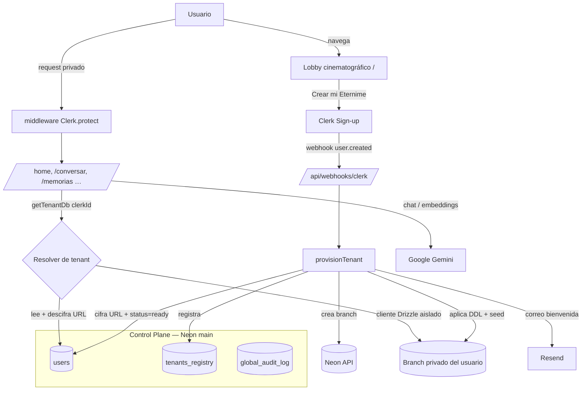
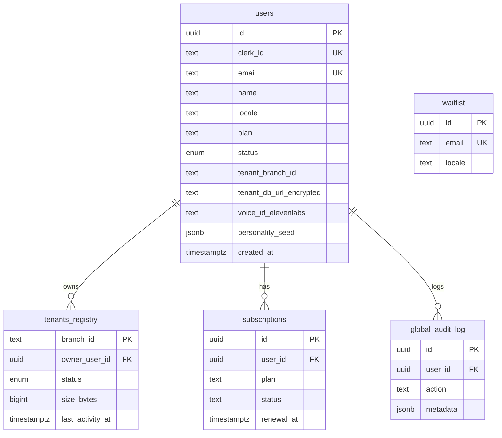
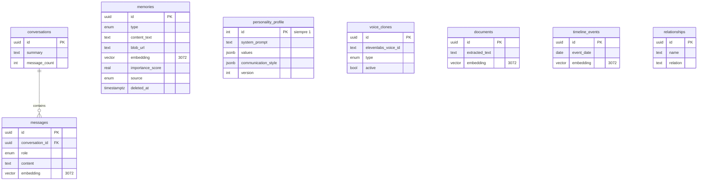
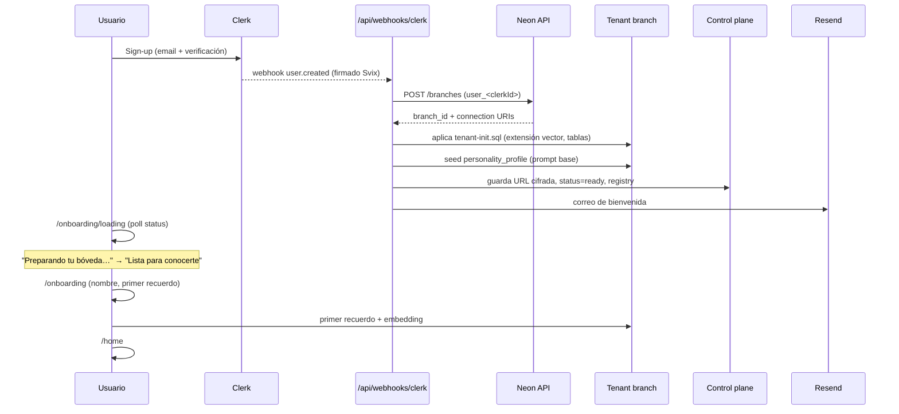

# Eternime

**Bóveda digital de memoria personal con IA que aprende durante toda la vida.**

Eternime es la plataforma donde cada persona construye, a lo largo de su vida,
una representación digital evolutiva de sí misma: una IA personal que aprende de
sus recuerdos, conversaciones, fotografías, audios, documentos, decisiones,
valores y forma única de pensar.

> Una herramienta de memoria viva. Nunca pretende ser humana ni reemplazar a
> nadie — preserva y descubre tu propia historia, a tu ritmo, durante toda tu
> vida.

---

## Arquitectura de la inteligencia — 2 capas

1. **Eternime AI (la marca, núcleo compartido).** La "voz cinematográfica" del
   producto: cálida, poética, serena. Su _system prompt_ base es **inmutable** —
   define la identidad de Eternime y no la modifican los usuarios.
2. **IA Hija (instanciada por cada registro).** Hereda el tono de Eternime AI y
   se personaliza con el _system prompt_ + memoria + voz de cada usuario.
   Evoluciona durante toda la vida de la persona.

El prompt base vive en [`lib/ai/prompts.ts`](lib/ai/prompts.ts) y se compone, en
cada request, con la capa personalizada (valores, estilo, memorias recuperadas
por RAG).

---

## Estado del proyecto

**Fase 1 — Multi-tenant + Auth + Onboarding** (este branch). Incluye:

- Esquema del control plane y del tenant (Drizzle, pgvector 3072 dims).
- Creación automática de un **branch de Neon por usuario** al registrarse.
- Cifrado AES-256-GCM de la URL de cada tenant (clave derivada por usuario).
- Resolución de tenant por request con `getTenantDb()` + caché LRU + guard rails.
- Webhook de Clerk idempotente que provisiona el tenant y envía el correo de
  bienvenida (Resend).
- Cliente de **Gemini** (`gemini-2.5-flash` / `-pro`, embeddings 3072).
- Onboarding cinematográfico de 3 pasos + loader de creación de bóveda.

El lobby cinematográfico (home pública) y el demo de inteligencia local
(`lib/eternime/*`) preexistentes se conservan; el demo se reemplaza por Gemini
en producción cuando las llaves están presentes.

---

## Arquitectura general



---

## Esquema — Control Plane (DB compartida)



## Esquema — Tenant (branch privado por usuario)



---

## Flujo de onboarding (creación de tenant)



---

## Seguridad y aislamiento

- **Aislamiento físico por usuario:** un branch de Neon por persona. Las
  consultas cruzadas entre tenants son estructuralmente imposibles — todo pasa
  por `getTenantDb(clerkId)`, que resuelve la URL internamente (el llamador
  nunca pasa una URL arbitraria).
- **URL de tenant cifrada en reposo** (AES-256-GCM) con clave derivada de
  `CLERK_SECRET_KEY` + `clerkId`. Nunca se expone al cliente.
- **Webhook idempotente** y verificado con firma Svix.
- **Soft delete por defecto** (`deleted_at`) en memorias y documentos.
- El middleware protege todo el espacio privado; el webhook se auto-autentica.

---

## Cómo correr en local

```bash
npm install
cp .env.example .env.local   # rellena las llaves disponibles
npm run dev                  # http://localhost:3000
```

Sin llaves de Clerk, el lobby corre en **modo demo** (sin auth). Sin
`GOOGLE_GENERATIVE_AI_API_KEY`, los embeddings se omiten de forma segura.

### Base de datos (Drizzle + Neon)

```bash
# Generar migraciones del control plane y aplicarlas al branch main:
npm run db:generate:control
npm run db:migrate:control

# Regenerar el DDL del tenant tras editar lib/db/schema/tenant.ts:
npm run db:generate:tenant
npm run db:build-tenant-init   # → lib/tenant/tenant-init.sql (se aplica a cada branch nuevo)
```

### Build de producción

```bash
npm run build && npm run start
```

---

## Variables de entorno

Ver [`.env.example`](.env.example). Resumen:

| Grupo    | Variables |
|----------|-----------|
| Database | `DATABASE_URL`, `DATABASE_URL_UNPOOLED`, `NEON_PROJECT_ID`, `NEON_API_KEY` |
| Auth     | `NEXT_PUBLIC_CLERK_PUBLISHABLE_KEY`, `CLERK_SECRET_KEY`, `CLERK_WEBHOOK_SECRET`, `NEXT_PUBLIC_CLERK_SIGN_IN_URL`, `NEXT_PUBLIC_CLERK_SIGN_UP_URL` |
| Cifrado  | `TENANT_URL_ENCRYPTION_KEY` (opcional; deriva de `CLERK_SECRET_KEY`) |
| IA       | `GOOGLE_GENERATIVE_AI_API_KEY`, `GEMINI_API_KEY` |
| Storage  | `BLOB_READ_WRITE_TOKEN` |
| Voz      | `ELEVENLABS_API_KEY`, `XI_API_KEY` |
| Emails   | `RESEND_API_KEY`, `RESEND_FROM_EMAIL` |
| Branding | `NEXT_PUBLIC_APP_URL`, `NEXT_PUBLIC_BRAND_NAME` |

---

## Cómo asignar rol admin (Clerk publicMetadata)

El rol vive en `publicMetadata.role` del usuario en Clerk. Para hacer admin a
Luis:

1. **Dashboard de Clerk** → _Users_ → seleccionar el usuario → _Metadata_ →
   _Public_ → añadir:
   ```json
   { "role": "admin" }
   ```
2. O vía API (Backend SDK):
   ```ts
   import { clerkClient } from "@clerk/nextjs/server";
   await (await clerkClient()).users.updateUserMetadata(userId, {
     publicMetadata: { role: "admin" },
   });
   ```

En el servidor se lee con `auth().sessionClaims?.metadata?.role === "admin"`
(requiere mapear `publicMetadata` a las _session claims_ en Clerk → _Sessions_).

---

## Configuración del webhook de Clerk

1. Clerk → _Webhooks_ → _Add Endpoint_:
   `https://eternime.org/api/webhooks/clerk`
2. Suscribir el evento `user.created` (y opcionalmente `user.updated`).
3. Copiar el _Signing Secret_ a `CLERK_WEBHOOK_SECRET`.

---

## Stack

Next.js 16 (App Router, Node) · TypeScript · Tailwind CSS · Framer Motion ·
React Three Fiber · Clerk · Neon + Drizzle (pgvector) · Google Gemini · Vercel
Blob · ElevenLabs · Resend.
