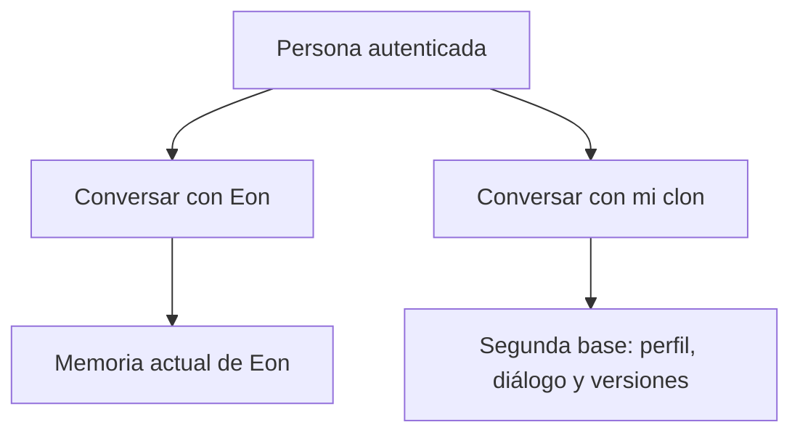

# Eon y mi clon: dos presencias, dos memorias

Decisión de Luis, 15 de septiembre de 2026: cada persona podrá conversar con Eon o con su propio clon. Eon conserva su identidad y su voz. El clon tendrá memoria propia, voz personal, imagen y una construcción progresiva corregible. Esta decisión reemplaza la idea de usar la voz personal para sustituir a Eon.

Complejidad estimada: **9/10 para la experiencia completa**. El reto principal es sostener una representación fiel y cambiante con recuerdos verificables, no simplemente generar voz o una cara. No existe una medida objetiva de «porcentaje de ser la persona». El producto debe mostrar qué mide cada indicador.

## Arquitectura implementada en esta revisión

- `/app/clon`: espacio separado con diálogo por texto, editor de memoria confirmada, versiones, evaluación de respuestas y preparación de voz/imagen.
- Una segunda base PostgreSQL por persona en su branch existente. Comparte compute y rol de servidor con ese branch, pero tiene otro nombre, conexión y esquema. No es otro proyecto ni otro servidor. `getCloneSql(clerkId)` resuelve al propietario desde la sesión; nunca acepta una URL de conexión del navegador ni recurre a la base de Eon.
- El inicio es explícito. Leer el estado no aprovisiona. Un branch suspendido o una conexión no disponible no se convierte en memoria vacía.
- `clone_facts`: cinco temas iniciales confirmados por la persona. `clone_fact_versions`: historial de cada corrección. `clone_exchanges`: diálogo, versión del perfil usada y valoración personal.
- Cambiar un tema crea una versión; recuperar un texto antiguo también exige confirmar una versión nueva. Control optimista de revisión evita sobrescrituras entre dispositivos.
- El modelo recibe únicamente el perfil confirmado y el historial del clon. No se importa automáticamente la memoria de Eon. Las respuestas del modelo no se promueven a hechos personales.
- Voz personal en `personal_voice_id`, con lectura compatible de clones anteriores. Las rutas de voz de Eon ya no eligen el clon del usuario. El audio del clon solo se genera para una respuesta perteneciente a ese mismo usuario.

Esta versión usa recuperación de contexto, no entrenamiento de pesos del modelo. No implementa todavía entrevista automática de Eon, extracción de propuestas de recuerdos, conversación oral bidireccional con el clon, avatar animado o avatar en vivo.

## Progreso honesto

| Indicador | Qué mide ahora | Qué no mide |
|---|---|---|
| Cobertura inicial | Porcentaje de los cinco temas con texto confirmado | Exhaustividad de una vida o calidad de personalidad |
| Me reconozco | Respuestas valoradas «Sí me representa» / respuestas valoradas, con la versión actual del perfil | Exactitud certificada; siempre se muestra el número de evaluaciones |
| Voz | Si hay una voz personal guardada y una prueba reproducible | Parecido acústico validado |
| Imagen | Seis ángulos distintos guardados; video opcional separado | Entrenamiento o existencia de avatar |

Al cambiar la memoria, las valoraciones anteriores siguen asociadas a sus respuestas, pero no califican la versión nueva. Sin evaluaciones se muestra «Por evaluar», nunca un porcentaje inventado.

En siguientes iteraciones, añadir pruebas con preguntas reservadas, hechos contrastados, preferencias cambiantes y evaluación de estilo. Separar fidelidad de voz, aspecto, memoria y forma de responder, en vez de combinarlas en una cifra de identidad sin fundamento.

## Hallazgos reales y correcciones

- La API de ElevenLabs respondió correctamente y reportó `can_use_instant_voice_cloning: false`. Tener una clave no garantiza permiso de clonación. La pantalla ahora consulta esa capacidad y explica el bloqueo.
- No se encontró `HEYGEN_API_KEY` en la configuración de producción consultada. Esta revisión no envía fotos a HeyGen ni genera avatares.
- La metadata de producción mostró cuatro cuentas, una con tenant listo y tres en error. Se reprodujo una creación de branch con respuesta 201 sin `connection_uris`. El código anterior fallaba en ese caso. Ahora consulta `/connection_uri` explícitamente y protege el aprovisionamiento concurrente. El SQL actual de inicialización del tenant sí pasó en la rama de prueba.
- Eon todavía combina rutas con base personal y tablas históricas `eternime_*` en la base compartida. Esa migración no está terminada; esta revisión no afirma lo contrario ni mueve los recuerdos existentes.
- Fotos: ahora se muestra el fallo de carga y no se permite seguir subiendo a ciegas; consentimiento exacto, propietario y tipo del Blob se validan en servidor. El video opcional y las capturas duplicadas no inflan el avance.
- Audio: límite explícito de tamaño y cantidad, extensión M4A correcta cuando el navegador graba MP4, cierre del micrófono y verificación del resultado al eliminar. Eon mantiene su voz actual.

## Pruebas realizadas

- Compilación de Next.js y TypeScript, lint de archivos afectados.
- `npm run test:clone`: límites de audio, capacidad real del proveedor, conteo de imágenes, resolución de conexión Neon, selección de base por persona y autorización de las rutas del clon.
- Prueba de integración sobre una rama QA aislada y dos bases nuevas vacías: migración SQL, aislamiento de datos, correcciones simultáneas, conservación de versiones, reintentos de mensajes, propiedad de valoraciones y actualización del porcentaje. Rama QA eliminada al terminar; no se modificaron los recuerdos de usuarios.
- No se generó una voz pagada, no se procesaron fotos con HeyGen y no hubo prueba visual autenticada en móvil ni una conversación completa de producción con el clon.

## Siguiente construcción

1. Desplegar y validar con una cuenta de prueba el flujo autenticado y la reparación del tenant; revisar la migración pendiente de Eon y el almacenamiento de medios.
2. Habilitar clonación en la cuenta API de ElevenLabs y probar la voz del titular con su grabación autorizada.
3. Añadir conversación oral del clon con transcripción en su propia base, conservando la voz y sesión de Eon por separado.
4. Conectar HeyGen con autorización explícita de envío de imágenes/audio, estado de trabajo persistente y reintentos sin duplicar cargos. Empezar por video generado; avatar en vivo es otra etapa.
5. Añadir propuestas de memoria desde entrevistas con Eon: fuente, texto propuesto, aceptación/corrección y versión. Nunca copiar todo el historial por defecto.
6. Ampliar memoria semántica, contradicciones, cambios temporales, borrado/exportación de identidad y evaluaciones reservadas antes de declarar fidelidad alta.

Antes de ofrecer el avatar como producto completo hay que resolver el almacenamiento actual de fotos en Blob público, la eliminación/exportación del nuevo espacio y la retención de versiones. No se afirma que esos controles existan ya.

## Referencias técnicas

- [Neon: crear una base en un branch](https://api-docs.neon.tech/reference/createprojectbranchdatabase).
- [Neon OpenAPI vigente](https://neon.com/api_spec/release/v2.json), usado para verificar `connection_uri` y contratos de creación.
- [ElevenLabs: clonación instantánea](https://elevenlabs.io/docs/eleven-creative/voices/voice-cloning/instant-voice-cloning), incluyendo preparación de muestras.
